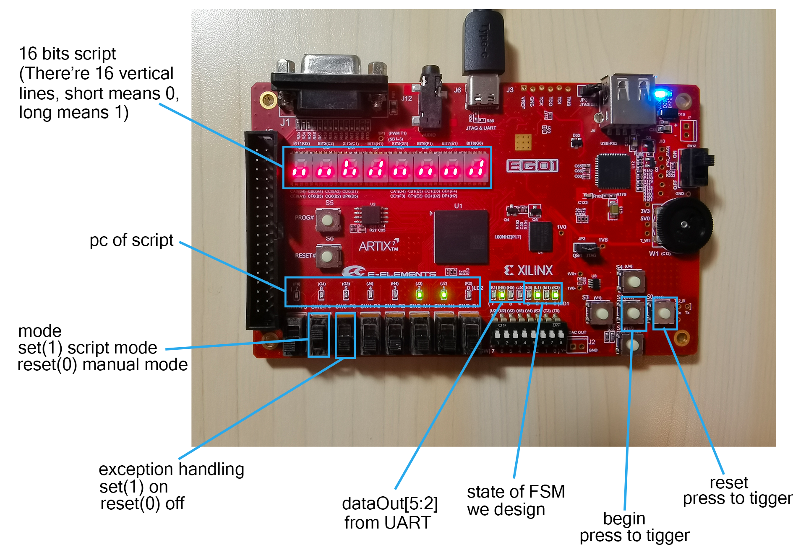

# CS207_23F_Project_GenshinKitchen
CS207 数字逻辑2023秋季 Project Genshin Kitchen

客户端及文档：https://github.com/Yan-ice/GenshinKitchen_2023F

## 小组成员分工

| 成员                                   | 分工                              |
| -------------------------------------- | --------------------------------- |
| @[wLUOw](https://github.com/wLUOw)     | 脚本模式及异常处理、项目架构、VGA |
| @[Yao1OoO](https://github.com/Yao1OoO) | 手动模式、算法设计                |
| @[mmhct](https://github.com/mmhct)     | 报告攥写、项目测试                |


## 项目结构

```
CS307_23F_Project_GenshinKitchen
│
├── constrs_1/new
│   └── cons.xdc
├── docs               # project document and report
├── pic                # picture related to project
├── sim_1/new          # simulation source
│   └── *.v
├── source_1
│   ├── ip
│   └── new
│       └── *.v        # main source(our code)
├── test_script
│   └── *.txt
├── LICENSE
└── README.md
```


## EGO1说明





**效果图（未连接VGA外设）**


**效果图（接入VGA外设）**

外接显示屏的上面一行的16位二进制码代表 script，下面一行左边8位和右边8位二进制码分别代表 UART 向客户端传输和接受的数据。


## 完成任务列表

### 报告攥写

- [x] 团队分工
- [x] 计划日程安排和实施情况
- [x] 系统功能列表
- [x] 系统使用说明
- [x] 系统结构说明
- [x] 子模块功能说明
- [ ] Bonus实现说明
- [ ] 项目总结
- [x] 对Project的想法和建议

### 代码规范

- [x] 结构化建模
- [x] 必要的注释
- [x] 阻塞与非阻塞赋值使用正确
- [x] 尽量避免出现数字形式常量

### 通信协议

- [x] 能够通过开关/按钮合理地向客户端发送操作信号
- [x] 能够接收并用LED显示来自客户端的四个反馈信号
- [x] 能够在手动模式/自动(脚本)模式之间进行切换，并通过一定形式反映模式状态

### 标准功能

- [x] 合法性检查：开发板能够阻止移动时(玩家未在机器跟前时)的非法交互
- [x] 合法性检查：开发板能够阻止不合理的存取物品交互
- [x] 合法性检查：开发板能够阻止不合理的投掷食材操作
- [x] 合法性检查：开发板能保证操作信号是One-Hot编码的

### 脚本执行

- [x] 能够合理地调试脚本执行器
- [x] 脚本能够让开发板执行开始/结束游戏的操作
- [x] 脚本能够让开发板执行合适的一系列选择目标/移动/交互等操作
- [x] 不包含jump/jumpif/wait until语句的脚本能够在普通厨房中做出一道菜
- [x] 包含所有语句的脚本能够在随机厨房中做出一道菜

### Bonus

- [x] 错误脚本状态自动处理
- [x] 用最短的时间在普通厨房中做出"香嫩椒椒鸡、树莓水馒头、冷肉拼盘"
- [x] 接入更丰富的外设

