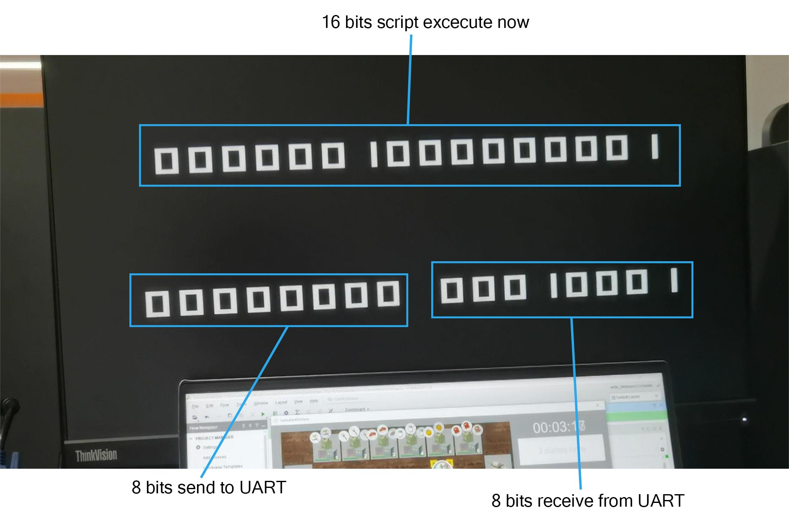
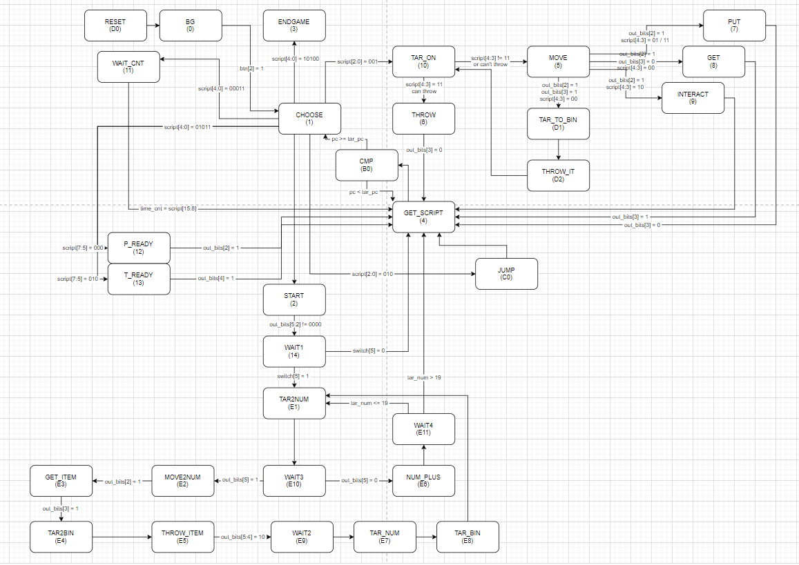
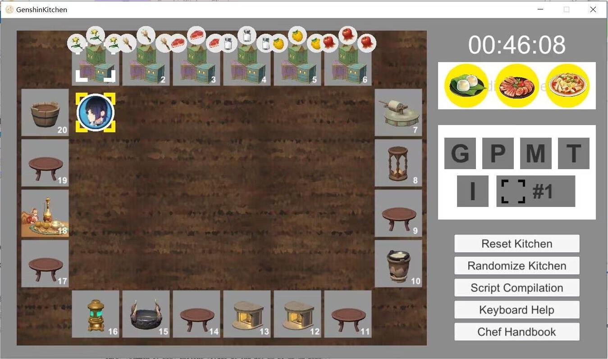

# CS207课程项目GenshinKitchen报告

本报告为 2023 年秋季南方科技大学计算机系课程 CS207 数字逻辑的课程项目报告

项目要求说明文档及客户端：https://github.com/Yan-ice/GenshinKitchen_2023F


## 团队分工

| 学号     | 姓名   | 分工                              | 贡献比 |
| -------- | ------ | --------------------------------- | ------ |
| 12211026 | 冯秋皓 | 报告攥写、项目测试                | 33.33% |
| 12211655 | 于斯瑶 | 手动模式、算法设计                | 33.33% |
| 12110120 | 赵钊   | 脚本模式及异常处理、项目架构、VGA | 33.33% |


## 计划日程安排和实施情况

| 时间          | 任务                                         |
| ------------- | -------------------------------------------- |
| 11.06         | Project 发布                                 |
| 11.06 - 11.13 | 熟悉文档和 Project 内容                      |
| 11.13         | Project 文档更新，确定选题为 Genshin_Kitchen |
| 11.13 - 11.15 | 架构设计，小组讨论                           |
| 11.15         | 架构试验                                     |
| 11.15         | 分配任务                                     |
| 11.19         | 优化架构                                     |
| 11.24         | 完成基础自动模式                             |
| 11.27         | 添加 reset 功能                              |
| 11.28         | 完成手动模式                                 |
| 11.29         | 发布评分标准                                 |
| 11.29         | 再次优化架构                                 |
| 12.01         | 完成自动模式及异常处理                       |
| 12.05         | 完成 VGA                                     |
| 12.10         | 项目测试，小组讨论                           |
| 12.19         | 完成报告撰写                                 |

**以上计划均顺利按时完成**


## 系统功能列表

- [x] 手动模式中，能够通过拨动拨码开关开始/结束游戏
- [x] 手动模式中，能够操控拨码开关调整目标机器，且检测并排除不合法情况
- [x] 手动模式中，能够通过按下按钮做出移动、拾取、放下、投掷、互动操作，且检测并排除不合法情况
- [x] LED 灯能够显示 EGO1 板与 UART 的数据传输情况以及当前系统在有限状态机中的状态
- [x] 七段数码管能够显示当前游戏模式，若为自动模式，则显示当前 pc 值对应的 16 位脚本码
- [x] 自动模式中，既能够在初始厨房状态，也能够在混乱厨房状态中正确执行给定的脚本
- [x] 自动模式中，能够对不合法的错误脚本进行一定程度上自动纠错
- [x] 能够用 VGA 信号接入显示屏，使传输数据显示更直观


## 系统使用说明
系统使用说明分为手动模式，自动模式和外接 VGA 显示的说明。

### 手动模式


如图所示，若需要开启自动模式，需要将拨码开关 SW6 调至低电平。拨动 start 开关开始游戏，调整如图所示的五个 target 开关来选择需要选中的目标，右边的五个按钮则是负责控制游戏的各种操作。除H标识的作用为提醒玩家当前模式外，其余输出指示灯主要用于debug 使用，玩家游玩时无需过多注意。


### 自动模式

如图所示，将拨码开关 SW6 调至高电平即可调至自动模式，若开始前厨房中非食材区存在物品，需要开启 SW5 ，避免引发错误。随后按下 S2 按钮即可开始脚本的运行。脚本运行过程中，七段数码管会显示当前运行的脚本内容，而 LD1 的八个 LED 灯则是显示目前的自动机状态，该功能主要为 debug 时使用。


### VGA显示



VGA 外接的显示屏上，共有 32 位二进制数。第 1 行的 16 位，代表当前 pc 值对应的 script；第 2 行前 8 位为传送给 UART 进而给客户端的数据，后 8 位代表客户端反馈给 UART 的数据。


## 系统结构说明
系统原理图如下：


系统顶层模块（Top）端口描述如下：

```verilog
module Top(  // top module
    input [4:0] button,
    input [7:0] switches,

    output [7:0] led,
    output [7:0] led2,

    // 7seg_tub
    output [7:0] tub_sel,
    output [7:0] tub_ctr1, tub_ctr2,

    // vga related
    output hsync,
    output vsync,
    output [3:0] red,
    output [3:0] green,
    output [3:0] blue,

    input clk,
    input rx,
    output tx
);

    wire uart_clk_16; // 153600Hz
    wire quick_clk;   // fast enough
    wire slow_clk;    // 10Hz
    wire tub_clk;     // 400Hz

    wire [7:0] dataIn_bits;         // data_in to UART
    wire [7:0] dataIn_bits_manual;  // data_in of manual mode
    wire [7:0] dataIn_bits_auto;    // data_in of auto mode
    wire dataIn_ready;

    wire [7:0] dataOut_bits;  // receive from UART
    wire [7:0] out_bits;      // out_bits every valid time
    wire dataOut_valid;

    wire script_mode;
    wire [7:0] pc;
    wire [15:0] script;

    wire rst;       // reset signal
    wire rst_auto;  // reset signal in auto mode

    wire [3:0] state_manual;  // state in manual mode
    wire [7:0] state_auto;    // state in auto mode

    assign dataIn_bits = switches[6] ? dataIn_bits_auto : dataIn_bits_manual;
    assign rst = switches[6] ? rst_auto : 0;
```

**时钟模块:**

uart_clk_16: 用于UART模块的时钟信号。

quick_clk: 用于快速操作的时钟信号。

slow_clk: 用于慢速操作的时钟信号。

tub_clk: 用于七段数码管显示的时钟信号。

**数据和控制信号:**

dataIn_bits: 从开关输入的数据，根据条件选择手动或自动模式的输入。提供给 UART 和 VGA，根据开关被选择为手动模式输入或自动模式的输入

dataIn_bits_manual: 手动模式下的数据输入。提供给 Output 和 Manual 模块，Output 负责显示输出，Manual 负责内部处理。

dataIn_bits_auto: 自动模式下的数据输入。提供给 Output 和 Automatic 模块，Output 负责显示输出，Automatic 负责内部处理。

dataIn_ready: 数据输入就绪信号，来自 UART。

dataOut_bits: 从 UART 接收到的数据。提供给 OutbitsHandle 模块进一步处理。

out_bits: OutbitsHandle 模块处理后的有效输出数据。提供给 Output，VGA（若使用）进行输出显示；给 Automatic 和 Manual 进行内部处理，具体提供方向由拨码开关模式选择决定。

dataOut_valid: 表示接收到有效数据的信号。

script_mode: 脚本模式信号，指示是否正在从 UART 加载脚本。

pc: 程序计数器，用于指示脚本内的位置。

script: 存储脚本指令的变量。

**复位信号:**

rst: 通用复位信号。

rst_auto: 自动模式下的复位信号。

**模式选择:**

switches[6]: 控制手动和自动模式的开关。 


## 子模块功能说明
本部分将说明所有新增模块的功能和输入输出规格，demo 中已给出的模块不作说明，出现多次的输入输出仅作一次说明。
### Automatic
```verilog
module Automatic (  
    input [0:0] clk,
    input [7:0] out_bits,      // 输出信号
    input [15:0] script,       // 脚本信号
    input [4:0] btn,           // 按钮绑定
    input [7:0] switch,        // 开关绑定
    output reg [7:0] pc,       // 左边八位LED灯，显示脚本储存地址
    output reg [7:0] in_bits,  // 八段数码显示管，显示16个0-1信号
    output [0:0] rst,          // 复位信号输出
    output [7:0] state_auto    // 自动模式状态输出
);
```
该模块实现了自动模式（脚本模式）下的一个有限状态机。将对应开关调整到自动模式后，该模块将被启用。按下开始按钮后，有限状态自动机启动，并将读取到的脚本信号接收，设置相对应的 next_state，进入 choose 阶段，根据脚本信号分别执行指向并交互，等待等操作，如此往复，直到接收到 end game 指令，游戏结束。

此外，如果初始厨房为随机厨房，在执行输入脚本前，会先执行一系列预设的清空脚本，该脚本主要实现遍历所有操作台，如果发现某操作台存在物品，则指向并移动至对应操作台，并将操作台的物品弃置垃圾箱，并设置检查指令确保垃圾箱为空后再执行后续的遍历，直到所有物品清除完成，再开始执行输入的脚本内容。

该模块描述的有限状态机如下：



### Constant
该模块定义了一系列需要用到的参数

### Manual
```verilog
module Manual (  
    input [0:0] clk,
    input [4:0] button,       // 操作按钮，分别控制拿取，放下，交互，移动，投掷
    input [7:0] switches,     // 靠右五个拨码开关控制target指向，靠左两个负责游戏模式和游戏开始
    input [7:0] out_bits,     // 由OutbitsHandle模块给入的数据信息
    output reg [7:0] in_bits, // 输出信息给Output模块
    output [3:0] state_manual // 输出信息给Output模块
);
```
该模块负责手动模式。通过控制拨码开关来完成对 target 的选择，选择的数字大小，由五个拨码开关组成的 5 位二进制数决定。选定 target 后，通过按下指定的按钮来完成游戏操作。同时，该模块加入了非法操作检验，对于不合理的操作，能识别这些情况并不将玩家给出的非法操作传输给客户端。该模块还考虑了持续交互以及单击交互等多种情况并给出了合理的设计。

该模块描述的有限状态机如下：


### OutbitsHandle
```verilog
module OutbitsHandle (
    input [0:0] clk,
    input [7:0] dataOut_bits,
    input [0:0] dataOut_valid,
    output reg [7:0] out_bits
);
```
该模块负责控制输出，使其一直保持有效状态。若 dataOut_valid 为 0，说明还未准备好，此时不能读取，如果 dataOut_valid 为1，说明可以读取，在下一时钟上升沿将会把 dataOut_bits 的值赋给 out_bits。

### Output
```verilog
module Output (
    input [0:0] clk,
    input [0:0] mode,                   // mode, 0 for manual, 1 for auto
    input [7:0] out_bits,               // 由OutbitsHandle得到
    input [7:0] in_bits_manual,         // 手动模式下的输入数据
    input [3:0] state_manual,           // 手动模式下的状态
    input [7:0] state_auto,             // 自动模式下的状态
    input [7:0] pc,                     // 脚本地址
    input [15:0] script,                // 脚本内容
    output [7:0] led,
    output [7:0] led2,
    output reg [7:0] tub_sel,           // 数码管
    output reg [7:0] tub_ctr1, tub_ctr2 // 数码管信息
);
```
该模块负责处理输出信息的内容。其中 mode 控制了当前是处理自动状态还是手动状态，因此这个模块自动与手动可以共用。该模块构建了一个有限状态自动机，并根据状态和脚本内容决定数码管的输出信息，以显示 output 的内容。

### QuickClock
```verilog
module QuickClock (
    input [0:0] clk,
    output reg [0:0] quick_clk
);
```
该模块产生一个足够快的时钟。

### SegTubClock
```verilog
module SegTubClock (
    input[0:0] clk, // 153600Hz
    output reg [0:0] tub_clk // 400Hz
);
```
该模块作用为用 153600Hz 的时钟分频产生一个 400Hz 的时钟用于七段数码管的显示。

### SlowClock
```verilog
module SlowClock (
    input [0:0] clk, // 153600Hz
    output reg [0:0] slow_clk // 10Hz
);
```
该模块作用为生成一个 10Hz 的时钟。

### UARTClock
```verilog
module UARTClock (
    input [0:0] clk,
    output reg [0:0] uart_clk_16
);
```
该模块作用为生成一个可用于 UART 的时钟 (153600Hz)。

### VGA
```verilog
module VGA (  // 640*480@60Hz
    input clk,
    input rst_n,
    input [15:0] script,
    input [7:0] in_bits,
    input [7:0] out_bits,
    output hsync,   // line synchronization signal
    output vsync,   // vertical synchronization signal
    // 3 color output
    output reg [3:0] red,
    output reg [3:0] green,
    output reg [3:0] blue
);
```
该模块用于生成 VGA 信号，hsync 和 vsync 为行同步信号和场同步信号，red，green，blue 为控制颜色的变量，输入的 script，in_bits，out_bits 为显示屏要显示的信息。


## Bonus实现说明
### 错误脚本状态自动处理
能够完成以下错误脚本的自动处理：

- 执行拾取指令时，玩家手里有东西则先将其丢至垃圾桶
- 执行投掷指令时，若目标不可被投掷，则改为移动过去放置

在自动模式有限状态机中，红色框部分表示对错误脚本进行的处理：


执行拾取指令前，预先根据 UART 返回的数据判断手中是否有物品。若有，则切换目标至垃圾桶，投掷，切换目标至目标机器，移动至目标机器，进行拾取操作；若没有，直接切换目标至目标机器，移动至目标机器，进行拾取操作。

执行投掷指令前，根据 script 判断目标机器是否可投掷。若不可，移动至目标机器，执行放置指令；若可以，直接进行投掷。

### 高效的脚本设计

小组成员根据菜谱设计出了针对指定三道菜的脚本，主要考虑了如下几点：

1. 对于需要等待，但是不需要一直交互的操作台，可以在操作交互之后，立马切换到其他地方进行其他操作

2. 由于移动需要耗费时间，因此可预先在食材区将需要的食材 throw 至需要操作的操作台旁边的桌子上（由于 throw 操作不需要移动至目标，可节省时间）
3. 合理地利用各个等待的间隙，也可以在完成一道菜的过程中，完成另一道菜的部分中间过程，进行"多线程工作"，也能在一定程度上节省时间

**最终耗费的时间为46秒**




### 接入更丰富的外设


如图所示，VGA 外接显示屏的上面一行的 16 位二进制码代表当前 pc 值对应的 script，下面一行左边 8 位和右边 8 位二进制码分别代表 UART 向客户端传输和接受的数据，更直观的显示了 EGO1 板与客户端的交互过程。

为了显示数字更加方便，这里使用常量提前储存了 0 和 1 的图形矩阵，在 VGA 扫描时，会判断是否是要输出数字的区域，如果是，会根据当前数字是 0 或 1 输出相应的数字。


## 项目总结
本项目综合运用了多种数字逻辑的基础设计，包括基础门电路，触发器，有限状态机，时钟的分频等，还大量使用时序逻辑和由状态机控制的组合逻辑。除此之外，还要求规范使用了参数的声明以及模块化设计的标准，使得代码更加整洁易读。

**难点分析：**

- 项目说明文档非常长且规则复杂，模板给出的 UART 模块的输入输出具体执行情况并没有办法进行充分了解（比如，dataOut_bit 时随时变化的还是只有 dataOut_valid 为 1 时才有效，dataIn_valid 不为 1 时能否改变 dataIn_bit，这一类问题都需要看懂 UART 的代码才能解决）

- 手动模块的难点在于，要区分拨码开关和按钮的不同操作，不能仅使用简单的组合逻辑，仍需设计有限状态机。而手动模式的非法操作处理更加复杂，玩家在手动操作的时候，常出现误操作导致产生非法操作，此时需要对当前状态有明确的分析，列出所有非法情况并将其阻拦在外。
- 自动模块的设计难点在于对脚本的分析以及状态机的设计，需要对接收到的脚本信息进行不同的选择处理，对于不同的指令，是否需要等待，移动，交互是否需要保持，都是要考虑到的问题，且对于出现的异常情况也要想办法进行判断和处理。
- 由于仿真没有办法精确模拟客户端传输数据实时变化的过程，因此，debug 要比预想中困难。后来找到了通过 LED 灯输出观察信号变化的 debug 方式，较为有效。
- VGA 需要的 4 分频信号，如果不用 ip 核里的 Clock Wizard 而使用自己写的分频模块会无法运行。然而在做课程项目的时候并不知道这一点，从代码到硬件到显示屏均进行了复杂的问题排查。

**值得注意的细节：**

- 如何避免 multi-driver 现象的发生？

  - 当数据需要多选一的时候，使用多路选择器
  - 当多个不同的操作都需要改变同一个变量的值时，设计有限状态机（手动模式不能直接采用简单的组合逻辑的原因）

- 低频分频器可以考虑自行编写，高频分频器必须使用 ip 核提供的 Clock Wizard，~~否则几乎必出问题~~

- 在有限状态机中，希望在某一状态到达是改变某变量的值，而这种改变又与变量自身的值有关，不可以使用组合电路赋值，必须在该状态到来时激活另一时钟的上升沿，而在探测这一时钟上升沿中进行非阻塞赋值。例如以下情况：

  ```verilog
  // 错误写法
  always @(state) begin
      case (state)
          S0: pc = pc + 2;
          S1: ...
          S2: ...
      endcase
  end
              
  // 正确写法
  always @(state) begin
      case (state)
          S0: tick <= 1;
          S1: tick <= 0;
          S2: tick <= 0;
      endcase
  end
  
  always @(posedge tick) begin
      pc <= pc + 2;
  end
  ```

- debug 时，如果不方便使用仿真，可以上板并使用 LED 灯，七段数码管等硬件输出设备进行 debug。

**有关小组合作的总结：**

- 要跟队友进行充分沟通，否则队友可能连你模块的输入输出代表什么都不清楚，从而出现由合作乌龙而产生的问题
- 队友节奏要尽量一致，否则可能出现阻塞他人工作进度的情况
- 在开始写代码前，所有人都需认真阅读项目要求文档，并在第一次小组讨论中**务必**统一每个人对项目要求的理解
- 代码规范，git 仓库文件规范，commit 信息提交格式，使用各类工具的版本等，在开始动工前最好可以统一


## Project 主题推荐：国际象棋
**Project设计：**

- 6 个拨码开关，代表当前选择的格子编号（0-63）

- 3 个按钮分别代表选中当前格棋子，取消选中棋子，确定移动棋子

- 1 个按钮用于重置游戏

- 2 个拨码开关用于选择兵升变的棋子，1 个按钮表示确定

- EGO1 板需要显示当前行棋方，步数

**基础分数：**

1. 能够开始，结束和重置游戏
2. 能够正确控制棋子行动，并屏蔽不合法移动
3. 能够实现特殊规则，如王车易位，吃过路兵，小兵升变
4. 能够进行简单的胜负判定，即吃掉对方的王
5. 能够实现单步悔棋

**Bonus部分：**

1. 能够进行将军和将死的判定
2. 能够进行储存游戏和读取已储存的游戏
3. 能够接入 VGA 显示器
